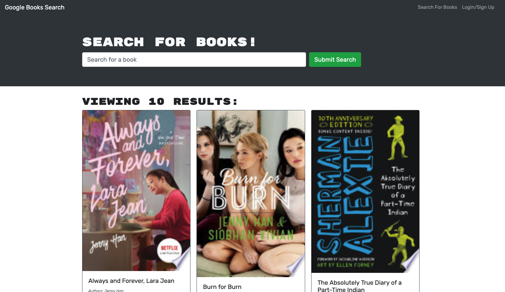

# Book Search Engine

Made for avid readers and book lovers, this web application allows users to search for new books to read so they can keep a list of books they'd like to purchase or read.

**Link to GitHub Repo:** https://github.com/rachealcolbert/books

**Link to Deployed App:**

**Screenshot of Application:**

## Description 
When you load the search engine, you are presented with a menu with the options: Search for Books and Login/Signup and an input field to search for books and a submit button.

When you click on the Search for Books menu option, you're presented with an input field to search for books and a submit button. If you are not logged in and enter a search term in the input field and click the submit button, you are presented with several search results, each featuring a book’s title, author, description, image, and a link to that book on the Google Books site. 

When you click on the Login/Signup menu option, a modal appears on the screen with a toggle between the option to log in or sign up. When the toggle is set to Signup, then you are presented with three inputs for a username, an email address, and a password, and a signup button. And when the toggle is set to Login, you are presented with two inputs for an email address and a password and login button.

When you enter a valid email address and create a password and click on the signup button, then your user account is created and you're logged in to the site. When you enter your account’s email address and password and click on the login button, then the modal closes and I am logged in to the site. 

WHEN I am logged in to the site
THEN the menu options change to Search for Books, an option to see my saved books, and Logout
WHEN I am logged in and enter a search term in the input field and click the submit button
THEN I am presented with several search results, each featuring a book’s title, author, description, image, and a link to that book on the Google Books site and a button to save a book to my account
WHEN I click on the Save button on a book
THEN that book’s information is saved to my account
WHEN I click on the option to see my saved books
THEN I am presented with all of the books I have saved to my account, each featuring the book’s title, author, description, image, and a link to that book on the Google Books site and a button to remove a book from my account
WHEN I click on the Remove button on a book
THEN that book is deleted from my saved books list
WHEN I click on the Logout button
THEN I am logged out of the site and presented with a menu with the options Search for Books and Login/Signup and an input field to search for books and a submit button  